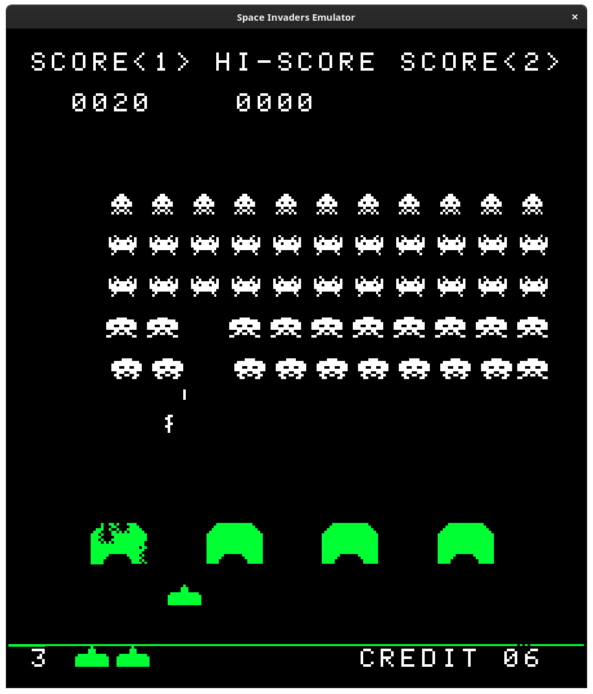
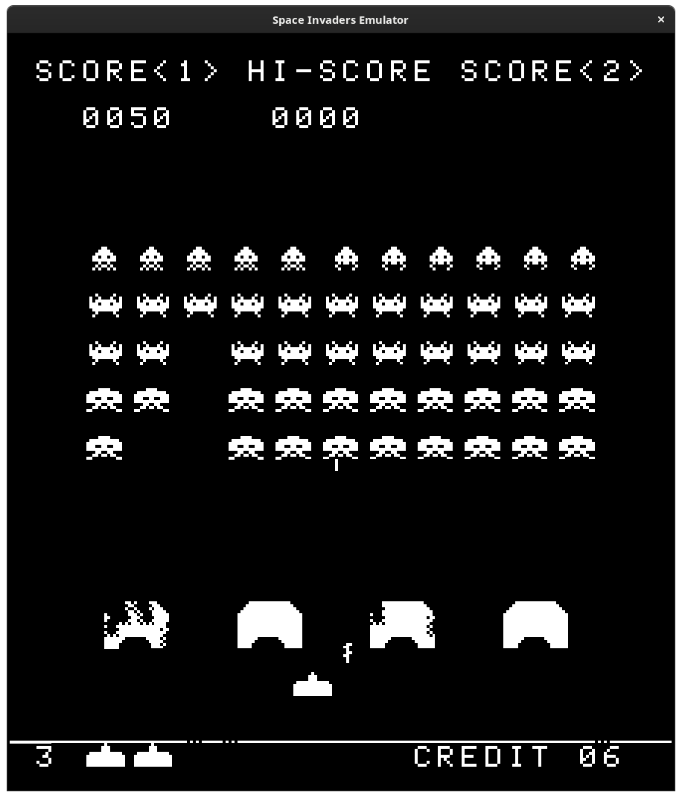

==============
i8080-emulator
==============

This repo contains a simple generic Intel 8080 emulator that can be used to
emulate systems. It contains two example emulators which demonstrate usage. The
The first emulator compiled as ``i8080-emulator`` runs old test executables
written for `CP/M <https://en.wikipedia.org/wiki/CP/M>`_. The other emulates
the original `TAITO 8080 <https://www.system16.com/hardware.php?id=629>`_ Space
Invaders machine.

Building
========
Building is done through a simple Makefile which is compatible with BSD Make
and GNU Make. Any recent version of Clang or GCC should work fine. Other
compilers will likely work too with changes to the Makefile. All testing was
done on AMD64 but everything should run fine on big-endian systems as well.
The Space Invaders emulator requires SDL2 for handling graphics and keyboard
input. More information can be found below:

* `<https://clang.llvm.org/get_started.html>`_
* `<https://gcc.gnu.org/install/>`_
* `<https://www.gnu.org/software/make/>`_
* `<https://wiki.libsdl.org/SDL2/Installation>`_

Once installed you can clone the repo and build using:

.. code-block:: shell

	$ git clone https://github.com/collinfunk/i8080-emulator
	$ cd i8080-emulator
	$ make all

Space Invaders
==============
Space Invaders requires the original files to play. I'm not sure of the
copyright status and I do not want to get banned off GitHub (I need a job)
so they are not linked here. If there happened to be four 2 KB files online
named, for example, ``invaders.e``, ``invaders.f``, ``invaders.g``, and
``invaders.h`` the emulator would expect them to be combined into an 8 KB
file. It would then expect the file name to be passed as a command-line
argument. These two steps can be done with the following commands:

.. code-block:: shell

	$ cat invaders.h invaders.g invaders.f invaders.e > invaders.rom
	$ ./space-invaders ./path/to/invaders.rom

Controls
--------

* 1: 1 Player
* 2: 2 Player
* 3: Insert coin
* ESC: Quit
* E: Toggle color
* Q: Toggle pause
* A: Move left
* D: Move right
* Space: Shoot

Screenshots
-----------

CPU Test Outputs
================
CPUTEST.COM
-----------

.. code-block::

	DIAGNOSTICS II V1.2 - CPU TEST
	COPYRIGHT (C) 1981 - SUPERSOFT ASSOCIATES

	ABCDEFGHIJKLMNOPQRSTUVWXYZ
	CPU IS 8080/8085
	BEGIN TIMING TEST
	END TIMING TEST
	CPU TESTS OK

	Instruction count: 33971311
	Cycle count:       255665052

TST8080.COM
-----------

.. code-block::

	MICROCOSM ASSOCIATES 8080/8085 CPU DIAGNOSTIC
	VERSION 1.0  (C) 1980

	CPU IS OPERATIONAL
	Instruction count: 651
	Cycle count:       4924

8080PRE.COM
-----------

.. code-block::

	8080 Preliminary tests complete
	Instruction count: 1061
	Cycle count:       7814

8080EXM.COM
-----------

.. code-block::

	8080 instruction exerciser
	dad <b,d,h,sp>................  PASS! crc is:14474ba6
	aluop nn......................  PASS! crc is:9e922f9e
	aluop <b,c,d,e,h,l,m,a>.......  PASS! crc is:cf762c86
	<daa,cma,stc,cmc>.............  PASS! crc is:bb3f030c
	<inr,dcr> a...................  PASS! crc is:adb6460e
	<inr,dcr> b...................  PASS! crc is:83ed1345
	<inx,dcx> b...................  PASS! crc is:f79287cd
	<inr,dcr> c...................  PASS! crc is:e5f6721b
	<inr,dcr> d...................  PASS! crc is:15b5579a
	<inx,dcx> d...................  PASS! crc is:7f4e2501
	<inr,dcr> e...................  PASS! crc is:cf2ab396
	<inr,dcr> h...................  PASS! crc is:12b2952c
	<inx,dcx> h...................  PASS! crc is:9f2b23c0
	<inr,dcr> l...................  PASS! crc is:ff57d356
	<inr,dcr> m...................  PASS! crc is:92e963bd
	<inx,dcx> sp..................  PASS! crc is:d5702fab
	lhld nnnn.....................  PASS! crc is:a9c3d5cb
	shld nnnn.....................  PASS! crc is:e8864f26
	lxi <b,d,h,sp>,nnnn...........  PASS! crc is:fcf46e12
	ldax <b,d>....................  PASS! crc is:2b821d5f
	mvi <b,c,d,e,h,l,m,a>,nn......  PASS! crc is:eaa72044
	mov <bcdehla>,<bcdehla>.......  PASS! crc is:10b58cee
	sta nnnn / lda nnnn...........  PASS! crc is:ed57af72
	<rlc,rrc,ral,rar>.............  PASS! crc is:e0d89235
	stax <b,d>....................  PASS! crc is:2b0471e9
	Tests complete
	Instruction count: 2919050698
	Cycle count:       23835665055
